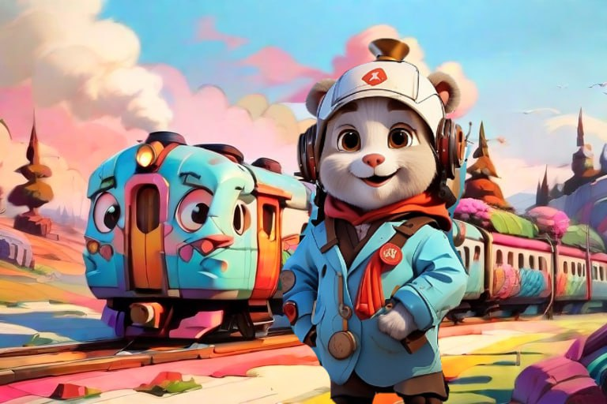

# 10 - 12 ноября 2023 года, Ставрополь


## Команда «Классификейшен репорт»:
- Бугаенко Иван;
- Подовинов Андрей;
- Зотов Никита;
- Знаев Алексей;
- Малицкий Александр.

## Кейс: «Виртуальный тренажер» от ОАО «РЖД» совместно с ООО «ОЦРВ»

### Описание кейса

Участникам предлагается разработать голосовой NLP виртуальный тренажер для проверки знаний по нормативной документации РЖД, работающий в режиме диалога.

Виртуальный тренажер позволит обучать персонал РЖД пользованию системой без необходимости использования реальных поездов и инфраструктуры, что может снизить риски возникновения аварийных ситуаций и повысить безопасность на железнодорожном транспорте. Кроме того, такой тренажер позволяет создавать различные сценарии обучения и тестирования, что может повысить качество обучения и тестирования персонала.

## Тизер решения



А вот и ваш проводник в мир нормативной документации РЖД! Почти как в поезде!

Решение представляет собой Web-приложение - виртуальный тренажер для сотрудников РЖД - которое при помощи интерактивных методик обучения помогает в усвоении нормативной документации. Приложение обладает следующим функционалом:

- **ментор**, в котором пользователь по вопросу может найти точную информацию из базы знаний посредством вопроса;
- **квест**, в котором пользователь сможет в игровой форме освоить теоретическую основу нормативной базы и сразу проверить себя в игровых ситуациях;
- **карточки**, с помощью которых можно удобно выучить определения из базы знаний.

Движок решения представляет собой модель понимания естественного языка (NLU), основанную на Encoder-only архитектуре BERT, с помощью которой осуществляется исследование языковых запросов. С использованием задачи семантического поиска находятся наиболее близкие по смыслу предложения. В дальнейшем они суммаризируются при помощи Decoder-only модели и подаются в качестве ответа (опционально).

Помимо этого, присутствуют модули озвучки и понимания речи, основанные на моделях машинного обучения.

Стек решения: Python, Streamlit, PyTorch, Transformers, Vosk.

Уникальность решения заключается в интерактивном подходе к изучению материала, а также в использовании предварительно обученных моделей, подготовленных непосредственно для текущей прикладной области.

## Подготовка окружения


### Установка файлов

Проект разработан для языка программирования **Python версии 3.11.5**.

Для того, чтобы разместить файлы с проектом локально, необходимо склонировать этот репозиторий при помощи команды:

```
git clone https://github.com/ZotovNikita/Classification_reporters.git
```

Проект разместится в директории, из которой вызван терминал, в котором исполнилась команда.

Далее необходимо установить все необходимые зависимости и создать виртуальное окружение.

### Виртуальное окружение

Создание виртуального окружения:
```
python -m venv venv
```

### Зависимости

Установка зависимостей:
```
pip install -r .\requirements.txt
```

### Запуск web-приложения

Для того, чтобы запустить приложение на локальном устройстве, необходимо выполнить следующую команду:
```
streamlit run app.py
```

## Описание решения

Глобально, решение состоит из трех концептуальных уровней, каждый из которых имеет убывающий приоритет:

1. инструментарий для решения задачи NLU: методы для понимания естественного языка и инструменты для его анализа и получения практических результатов;

2. набор механик и подходов для усваивания новой информации: способы для более эффективного запоминания новой информации для сотрудников РЖД;

3. интерфейс, реализующий первый и второй уровни.

В результате работы на хакатоне были реализованы все три уровня, о которых более подробно речь пойдет далее.

### Инструменты для анализа текстов

Была разработана небольшая библиотека, содержащая в себе набор инструментов для представления, обработки и анализа текстовых данных.

Механизм строится следующим образом: на вход в пайплайн подается текст, без предварительной обработки, с целью получения степени схожести с каждым элементом из нормативной базы знаний РЖД, которая была предварительно обработана и загружена. 

Затем данный текст приводится к нижнему регистру и токенизируется (в данном случае, используется родной токенизатор от модели SBERT, речь о которой пойдет далее). А затем строится эмбеддинг входного текста при помощи Encoder-only модели **SBERT**, созданной для русского языка. 

Полученный эмбеддинг текста-запроса попарно сравнивается с каждым предварительно созданным эмбеддингом элемента базы знаний путем вычисления косинусного расстояния между векторами-эмбеддингами; $k$ наибольших - самые похожие элементы базы знаний на данный запрос.

Опционально, можно применять суммаризацию для выходного результата при помощи модели **rut5_sum**.

Полученный результат используется непосредственно в механиках запоминания в зависимости от востребования.

Также предусмотрен ввод данных для модели при помощи голоса. Голос конвертируется в текст с помощью модели **VOSK**.

### Механики для запоминания

Предварительно, был изучен средний пользователь виртуального тренажера. 

В основном, это люди 30-50 лет, упорные, целеустремленные. И всех их объединяет то, что становится труднее заучивать большие объемы информации.

Чтобы справиться с этой проблемой, было принято решение использовать элементы геймдева, которые отлично подходят для удержания людей и фокусировании на обучении, а именно:

1. процесс изучения новой информации представлен в виде квеста, в ходе которого возникают реальные ситуации, в которых требуются навыки знания нормативной базы РЖД;

2. в сам квест встроены мини-игры, головоломки и задания, призванные помогать усваивать теоретический материал;

3. в приложении присутствуют карточки, которые позволяют периодически запоминать термины.

Исходя из видения пользователя, вышесказанного, получается интерфейс, обладающий данными механиками, которые реализуются за счет методов NLP.

### Функционал

Web-приложение состоит из следующих компонент:

1. квесты (содержит список квестов по темам из нормативных документов РЖД, в которых содержится история, теоретическая выжимка и задания);

2. ментор (система, позволяющая задавать вопросы к базе знаний);

3. карточки (система запоминания нового материала);

4. экзамен (проверка знаний, проводящаяся в формате экзамена - ответ на вопросы, получение финальной оценки на основании ответов).
